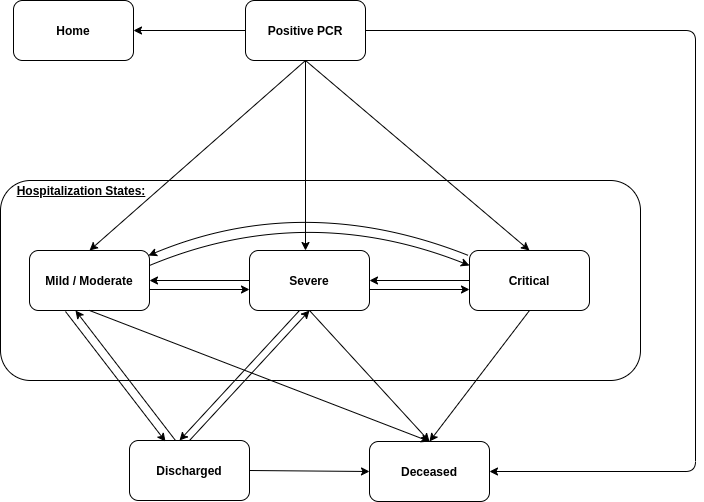

# COVID-19 individual illness trajectory model  

Based on the model developed and described in:  
[Development and validation of a machine learning model for predicting illness trajectory and hospital resource utilization of COVID-19 hospitalized patients - a nationwide study](https://academic.oup.com/jamia/advance-article/doi/10.1093/jamia/ocab005/6105188?searchresult=1)  
Original model code [here](https://github.com/JonathanSomer/covid-19-multi-state-model)

Updated to include new patient states (including PCR positive to hospitalization transitions) and based on Israel data from July-December

This repository contains code for a multi-state survival analysis model which can be used to predict covid-19 patients' illness trajectories from time of positive PCR diagnosis or hospitalization up to time of recovery or death.  
Transitions between states (such as: "severe" to "death") are modeled using survival models with competing risks, and the patient's trajectory is estimated via Monte-Carlo path sampling over these transitions, while updating time-dependent patient covariates.  

[Jonathan Somer](https://github.com/JonathanSomer), [Rom Gutman](https://github.com/RomGutman), Asaf Ben Arie, Malka Gorfine & Uri Shalit  
[Hagai Rossman](https://github.com/hrossman), [Tomer Meir](https://github.com/tomer1812) & Eran Segal
